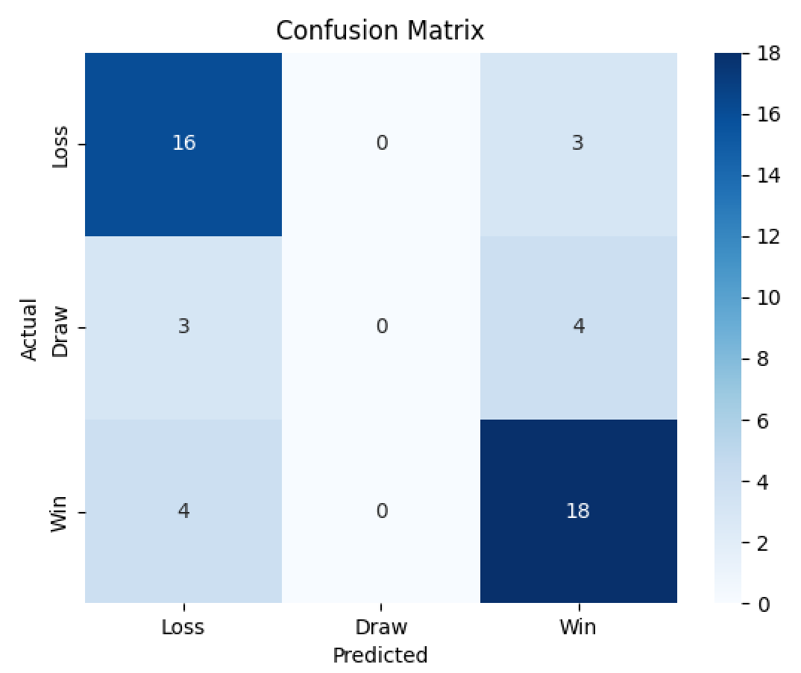

# Football Match Prediction Model

This project uses machine learning to predict football match outcomes for FC Porto based on historical match data.

## Project Overview

The system analyzes historical football match data, engineers relevant features, and trains a predictive model (Random Forest Classifier) to forecast match results (win, draw, or loss).

## Project Structure

- `data_pipeline.py` - Processes raw CSV match data
- `features.py` - Creates engineered features for the model
- `model.py` - Builds, trains and evaluates the prediction model
- `raw_data/` - Contains historical match data in CSV format
- `data/` - Stores processed datasets and model files
- `Makefile` - I decided to use a Makefile to simplify running the code

## Setup

Create and activate a Python virtual environment:

```bash
make env
```

## Usage

Run the complete pipeline:

```bash
make run
```

Or run a specific component:

```bash
make run_single file=data_pipeline.py
make run_single file=features.py
make run_single file=model.py
```

## Model Performance

### Confusion Matrix



The confusion matrix above shows the performance of the model in predicting match outcomes for Porto:
- Rows represent actual outcomes (0=Loss, 1=Draw, 2=Win)
- Columns represent predicted outcomes

The model behaves rather poorly with draws, nonetheless, it achieves an accuracy of around 75%.

## Exit Environment

To deactivate the virtual environment:

```bash
deactivate
```

## Future Work

Although the model can be made more accurate with individual player stats, I believe the best performance improvement would come from sentiment analysis using LLMs, which provide context for a given match.